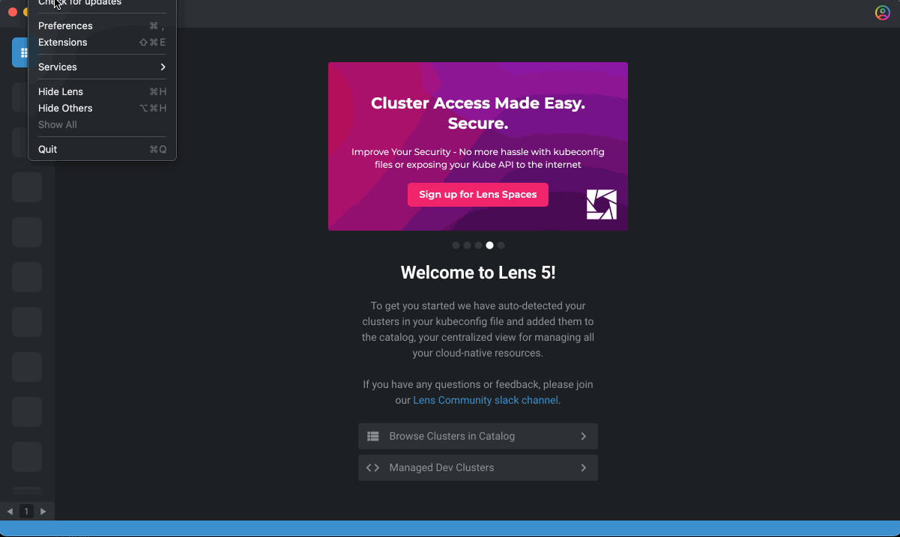
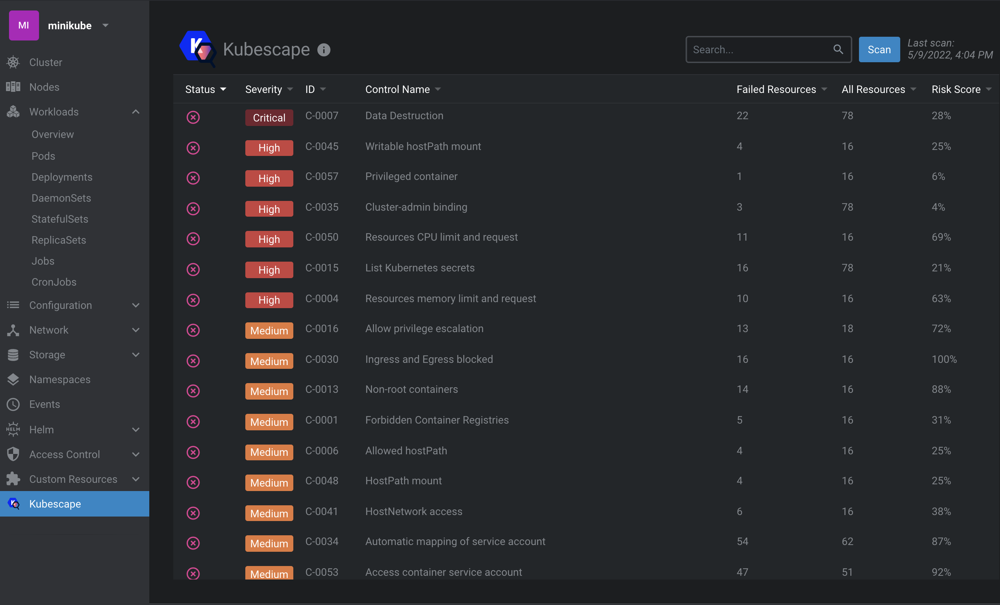
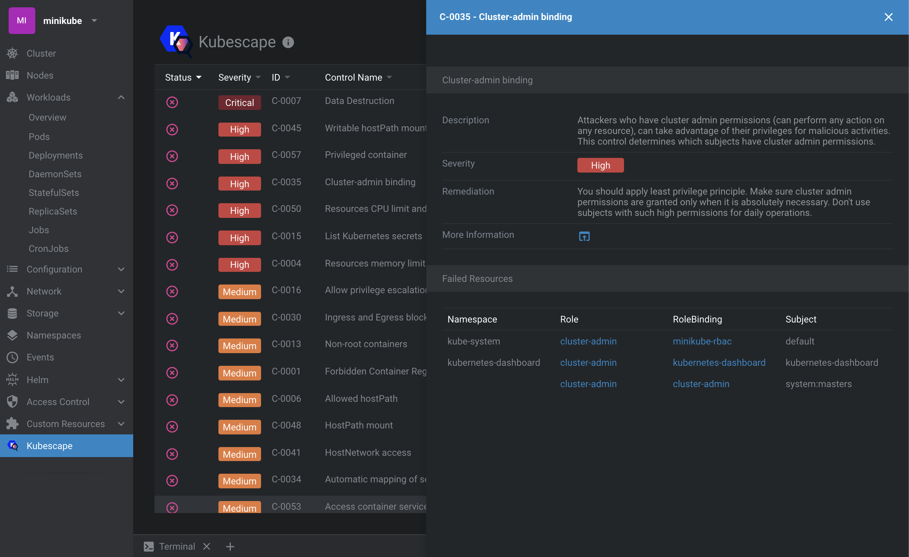
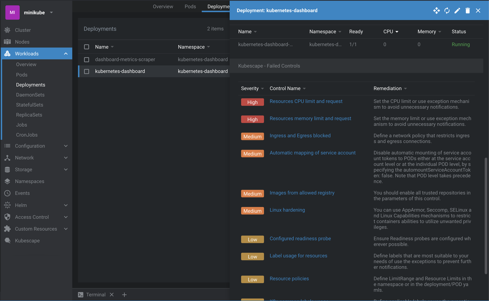

# Kubescape Lens Extension

This extension brings out the power of [Kubescape][kubescape] into [Lens][lens] so managing cluster was never simpler and safer.

[![License][license-img]][license]


## Prerequisites

* Lens should be [installed][lens-installation] on your workstation. Please consult the following support matrix for version compatibility:

  | Lens | Kubescape Extension |
  |------|---------------------|
  | 5.4  | 0.1.x               |
  | 5.5  | 0.1.x               |
  | 6.0  | 0.2.x               |

## Installation

1. Open Lens and navigate to the __Extensions__ page (or press <kbd>Command</kbd> + <kbd>Shift</kbd>+<kbd>E</kbd> on macOS).

2. Enter ``@kubescape/lens-extension`` into the __Install Extension__ box

3. Click on the __Install__ button.


 


## Getting Started

Kubescape extension for Lens will help you to easily scan and detect misconfigurations, software vulnerabilities, and RBAC (role-based-access-control) violations in your K8S cluster.

#### Cluster-level information

* Navigate to `Kubescape` from the side menu.
* A Kubescape scan runs automatically on your cluster for the first time. You can also run a scan on-demand by clicking the __Scan__ button.
* The table reflects a cluster-level summary of kubescape scan results.

 

<br />

* To find out more information on a specific Kubescape control and its failed resources, click on it to open the side bar for a detailed view:

 

#### Object-level information

* Kubescape information is also available at the object level. Click on the desired resource to open the details side bar and scroll down for Kubescape section:

>_This view shows only failed controls. If you don't see any that's a good thing :)_

 


## Development mode

> You must have a working [Node.js][nodejs] environment.

1. Clone the repository and then link to it:

```sh
git clone https://github.com/kubescape/lens-extension.git 
mkdir -p ~/.k8slens/extensions
ln -s $(pwd)/lens-extension ~/.k8slens/extensions/kubescape
```

2. Install dependencies and build the extension by running `make` or `npm` commands:

```sh
cd lens-extension
make build
```

__OR__

```sh
cd lens-extension
npm install
npm run build
```

3. To put your development build into watch mode you can run:

```sh
npm start
```

4. Open Lens and navigate to the Extensions page (or press <kbd>Command</kbd> + <kbd>Shift</kbd>+<kbd>E</kbd> on macOS).

5. If everything is fine, you should see the ``@kubescape/lens-extension`` extension listed under __Installed Extensions__. Click __Enable__ to enable it


To reflect your source code changes, reload the Lens window by pressing <kbd>Command</kbd>+<kbd>R</kbd> (macOS). Note: Any changes which affect Len's main thread will require a restart to the Lens application.


 

### Uninstall

1. Remove the link:
```sh
rm ~/.k8slens/extensions/kubescape
```

2. Restart Lens application.


[lens]: https://github.com/lensapp/lens
[kubescape]: https://github.com/armosec/kubescape
[license]: https://github.com/kubescape/lens-extension/blob/master/LICENSE
[license-img]: https://img.shields.io/github/license/kubescape/lens-extension
[nodejs]: https://www.nodejs.org/en/
[lens-installation]: https://github.com/lensapp/lens#installation
